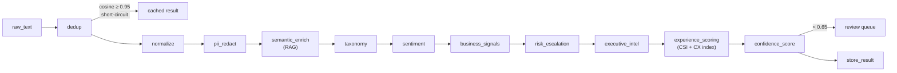
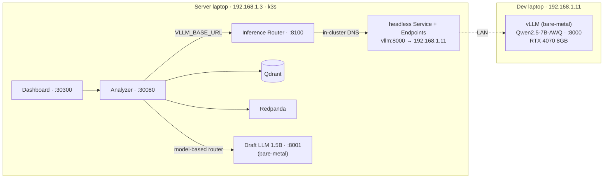
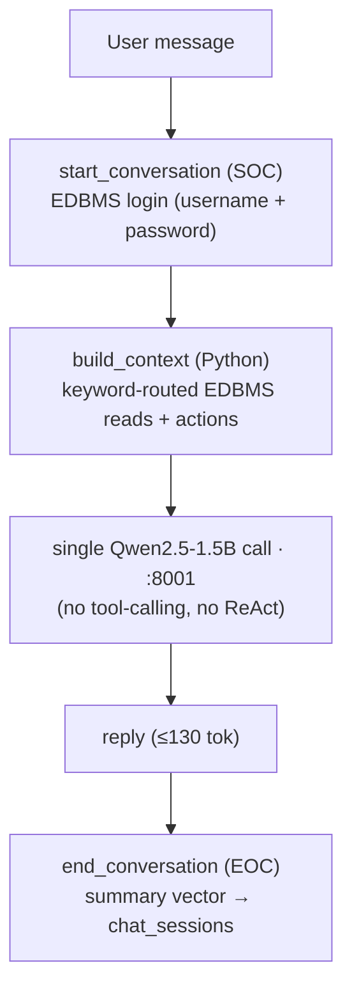

<div align="center">

# CX Semantic Analyzer

**Customer Experience intelligence — a self-hosted 7B LLM pipeline on consumer GPUs (two-laptop home lab)**


</div>

---

A 12-stage LangChain LCEL pipeline (7 LLM stages + rule-based dedup/normalize/PII/confidence/store), Qdrant vector DB, Rust/Kafka ingestion, a draft-model support chatbot with deterministic EDBMS tools, a closed-loop fine-tuning pipeline (SFT → DPO → AWQ), and a Next.js analytics dashboard. Runs on a two-laptop home lab over LAN.

> **Measured:** 82 tok/s · 63 ms TTFT (p50) at concurrency 2 on a laptop RTX 4070 8GB (AWQ + Marlin). Full 7-LLM-stage pipeline ≈ **14 s p50 / 16 s p95** over a 676-item real dataset. Methodology and comparison to published numbers (A100 Qwen, desktop llama.cpp) in [`tests/BENCHMARK_RESULTS.md`](tests/BENCHMARK_RESULTS.md) — these are single-setup home-lab measurements, not a controlled cross-hardware study.

---

## What It Does

Paste any customer feedback → get back structured intelligence in ≈ 14 s (p50, full pipeline):

| Output | Detail |
|---|---|
| Taxonomy | Category (Billing/Product/Support/Shipping/Account/Onboarding) + subcategory + confidence |
| Sentiment & emotions | positive/negative/neutral + emotion list + intensity 1–10 |
| Business signals | Churn risk · upsell opportunity · feature requests · bug reports · competitor mentions |
| Risk escalation | Escalate flag · risk level (low/medium/high/critical) · suggested action |
| Executive intelligence | 2-sentence summary · action items · health score 1–10 |
| Experience indices | Customer Satisfaction Index (8 dims) + Customer Experience Index (4 dims), each scored 1–6 → % |
| Confidence score | Weighted pipeline confidence (taxonomy × sentiment consistency × novelty) |
| Deduplication | Cosine similarity ≥ 0.95 → cached result returned, zero LLM calls |

---

## Architecture


The **Rust router** (`router.rs`) is **optional** and built for the multi-backend case: it
load-balances across vLLM backends by live queue depth (`vllm:num_requests_running` +
`waiting`) instead of client-side round-robin. With a single backend it adds no value, so
the **default deployment points the analyzer's `VLLM_BASE_URL` straight at vLLM**; set it to
the router only when running more than one backend.

### Pipeline Stages



### Deployment Topology

| Machine | IP | Role |
|---|---|---|
| Dev laptop | 192.168.1.11 | vLLM bare-metal (RTX 4070 8GB) — port 8000 |
| Server laptop | 192.168.1.3 | k3s cluster — all services (NodePorts below) |

vLLM runs off-cluster. A headless k8s `Service + Endpoints` routes in-cluster DNS (`http://vllm:8000`) to the dev laptop over LAN — no code changes needed inside the cluster.



| Service | NodePort | URL |
|---|---|---|
| Analyzer API | 30080 | `http://192.168.1.3:30080` |
| Dashboard | 30300 | `http://192.168.1.3:30300` |
| Draft LLM (1.5B) | 8001 | bare-metal on server laptop |

---

## Extensions

Beyond the core pipeline, the following are fully implemented:

### Support Chatbot (`analyzer/chatbot/`)
A customer-support chatbot that runs entirely on the **Qwen2.5-1.5B draft model**
(server laptop 1650 Ti, port 8001). The 1.5B model can't do reliable LLM tool-calling,
so rather than a ReAct loop the "tools" are resolved **deterministically in Python**
(`context_router.py`): keyword routing fetches the logged-in customer's own rows from
the EDBMS — and performs any clearly-requested action — then hands the model one compact
`CONTEXT` block to phrase its reply from. This keeps order/refund/escalation handling
working on a weak model with no hallucinated order numbers and no cross-customer leakage
(every query is scoped by `user_id`).



Python-resolved "tools" (keyword-triggered, all scoped to the authenticated user):
- `get_recent_purchases` — order / delivery / status questions (keyword-filtered, stopword-aware so generic "what's my order status?" surfaces live orders)
- `get_account_info` — account / tier / membership questions (profile + order rollup)
- `create_ticket` — refund / complaint / escalation actions
- FAQ lookup — common topics (`tools.py:_FAQ`)

Auth: SQLite EDBMS (`edbms.py`) — login with username + password; reads are filtered to
the customer's own account. Demo users: `alice/bob/carol/dave/eve` — password `pass123`.

The big 7B model is **not** used by the chatbot (it's the pipeline's model). Session
memory is capped at 250 tokens; sessions expire after 1 hour.

### Topic Clustering (`analyzer/clustering.py`)
KMeans over stored feedback embeddings. Auto-selects k via silhouette score sweep (k=3–12). LLM generates 3–5 word human-readable labels per cluster. Writes `cluster_id` + `cluster_label` back to Qdrant payloads.

### Semantic Drift Detection (`analyzer/drift.py`)
Three signals comparing recent (7 days) vs baseline (30 days):
- Embedding centroid cosine distance (alert > 0.10)
- Negative sentiment fraction shift (alert > 15pp)
- Category KL divergence (alert > 0.30)

### Active Learning Loop (`analyzer/active_learning.py`)
Items with `pipeline_confidence < 0.65` are queued for human review. Human corrections patch the stored analysis and add to `few_shot_examples` — future analyses benefit via RAG.

### Confidence Scoring (`analyzer/pipeline/confidence_stage.py`)
Weighted score: taxonomy confidence (0.4) × sentiment consistency (0.3) × novelty (0.3).

### Agentic Review Workflow (`analyzer/review_agent.py`)
Separate LangGraph agent that synthesises queue status, drift alerts, and escalation counts into a `ReviewReport` with action items and risk level.

### Load-Aware Inference Router (`kafka_queue/src/bin/router.rs`) — *optional*
A Rust router built for the multi-backend case (it is **not** in the default single-GPU
deployment). When enabled, it scrapes each backend's `vllm:num_requests_running` +
`num_requests_waiting`, tracks an EWMA of queue depth plus in-flight requests it has
dispatched, and routes each call to the least-loaded healthy backend (round-robin only as a
cold-start fallback), reverse-proxying the OpenAI-compatible request. To use it: build the
`cx-router` image, `kubectl apply -f k8s/router/`, and set `VLLM_BASE_URL` to the router.
With one backend, leave it out — there's nothing to balance.

---

## Stack

| Layer | Technology |
|---|---|
| LLM inference | vLLM · Qwen2.5-7B-Instruct-AWQ · AWQ + Marlin kernel |
| Draft model | Qwen2.5-1.5B-Instruct · port 8001 · server laptop 1650 Ti |
| Pipeline | Python · LangChain LCEL · Pydantic structured outputs |
| Agent framework | LangGraph ≥ 0.2 · ReAct · ToolNode |
| Vector DB | Qdrant · `all-MiniLM-L6-v2` (384-dim) |
| Customer EDBMS | SQLite · keyword-aware purchase history queries |
| Web search | DuckDuckGo (langchain-community, no API key) |
| Message broker | Redpanda (Kafka-compatible, no ZooKeeper) |
| Ingestion gateway | Rust · Axum · rdkafka |
| API | FastAPI · optional API-key auth (`API_KEY` env var) |
| Dashboard | Next.js 14 · Tailwind CSS · SWR · Recharts |
| Kubernetes | k3s · flannel CNI |
| Monitoring | Prometheus · Grafana |

---

## Performance

Measured on RTX 4070 Laptop 8GB, Qwen2.5-7B-Instruct-AWQ, `--quantization awq_marlin`, `--max-num-seqs 2`:

| Concurrency | Req/s | Tok/s | TTFT p50 | TTFT p95 | ITL p95 |
|:-----------:|:-----:|:-----:|:--------:|:--------:|:-------:|
| 1 | 3.0 | 44 | 56 ms | 60 ms | 22 ms |
| **2** | **5.9** | **82** | **63 ms** | **65 ms** | **22 ms** |
| 4 | 6.1 | 88 | 381 ms | 422 ms | 22 ms |
| 8 | 5.7 | 85 | 958 ms | 1161 ms | 23 ms |

**Concurrency 2 is the sweet spot** — matches `--max-num-seqs 2`. Beyond c=2, requests queue and TTFT degrades sharply while tok/s plateaus.

For the full report and comparison to published numbers (A100 official Qwen benchmark, desktop RTX 4070 llama.cpp): [`tests/BENCHMARK_RESULTS.md`](tests/BENCHMARK_RESULTS.md).

---

## Quick Start

### 1. Start vLLM (dev laptop, bare-metal)
```bash
# Open firewall so server can reach it
sudo firewall-cmd --add-port=8000/tcp

vllm serve Qwen/Qwen2.5-7B-Instruct-AWQ \
  --host 0.0.0.0 --port 8000 \
  --dtype half --max-model-len 1024 \
  --gpu-memory-utilization 0.82 \
  --quantization awq_marlin \
  --max-num-seqs 2 --enforce-eager
```

### 2. Start draft LLM (server laptop, bare-metal)
```bash
vllm serve Qwen/Qwen2.5-1.5B-Instruct \
  --host 0.0.0.0 --port 8001 \
  --dtype half --max-model-len 1024 \
  --gpu-memory-utilization 0.60 \
  --max-num-seqs 4 --enforce-eager
```

### 3. Deploy to k3s (server laptop)
```bash
# Sync source from dev laptop (run on server)
rsync -av vinesh@192.168.1.11:/home/vinesh/Documents/Summer2026/ ~/Summer2026/

# Build custom images
cd ~/Summer2026
docker build -t semantic-analyzer-dev .
docker build --network=host -t cx-gateway kafka_queue/
docker tag cx-gateway cx-producer
docker tag cx-gateway cx-consumer
docker build -t cx-dashboard dashboard/

# Import into k3s containerd (no output until done — wait for prompt)
for img in semantic-analyzer-dev cx-producer cx-consumer cx-dashboard; do
  docker save $img | sudo k3s ctr images import -
done

# Deploy
kubectl apply -f k8s/namespace.yaml
kubectl apply -f k8s/vllm/ k8s/draft-llm/ k8s/qdrant/ k8s/redpanda/ \
              k8s/analyzer/ k8s/producer/ k8s/consumer/ \
              k8s/dashboard/ k8s/monitoring/

# Verify
kubectl -n cx-pipeline get pods
curl http://192.168.1.3:30080/ready
```

### 4. Access
| What | URL |
|---|---|
| Dashboard | http://192.168.1.3:30300 |
| Support Chat | http://192.168.1.3:30300/chat — login: `alice` / `pass123` |
| API docs | http://192.168.1.3:30080/docs |
| Grafana | http://192.168.1.3:30300/grafana (separate Grafana NodePort) |

---

## Pipeline Usage

```bash
# Enter dev container
docker-compose run --rm dev

# Analyze single feedback
python -m analyzer.main --text "My order arrived damaged, I want a refund"

# Batch from CSV
python run_pipeline.py --source csv --file tests/dummy_data/reviews.csv \
  --text-col text --out results.json

# Run tests (mocked — no vLLM needed)
python -m pytest tests/test_pipeline.py -v

# Run benchmarks (requires vLLM running)
python tests/benchmark_vllm.py --concurrency 1 2 4 --prompts 20
```

---

## Fine-Tuning Pipeline (`training/`)

QLoRA fine-tuning on pipeline outputs using unsloth + TRL. Requires `pip install unsloth trl datasets autoawq`.

```bash
# 1. Export high-confidence pipeline outputs as SFT training data
python training/export_sft_data.py --min-confidence 0.75 --out training/data/sft.jsonl

# 2. Export human corrections from active learning as DPO pairs
python training/export_dpo_data.py --out training/data/dpo.jsonl

# 3. SFT — QLoRA on Qwen2.5-7B-Instruct (not AWQ — fine-tune in BF16)
python training/sft_train.py --data training/data/sft.jsonl

# 4. DPO — preference alignment on SFT adapter
python training/dpo_train.py --data training/data/dpo.jsonl

# 5. Merge LoRA + quantize to AWQ → deploy back to vLLM
bash training/merge_and_quantize.sh
```

---

## Project Structure

```
├── analyzer/                       # FastAPI app + LangChain pipeline
│   ├── api.py                      # FastAPI endpoints (22 routes + optional API-key auth)
│   ├── main.py                     # analyze_single / analyze_batch entry points
│   ├── llm.py                      # vLLM client — single endpoint → router (no client-side LB)
│   ├── routing.py                  # Model-tier routing: 1.5B model-based → keyword fallback
│   ├── scheduler.py                # Semantic request scheduler (prefix-cache locality)
│   ├── metrics.py                  # Per-stage histograms, token/call accounting, research metrics
│   ├── store_retry.py              # Kafka-backed durable retry lane for failed Qdrant writes
│   ├── schemas.py                  # Pydantic structured output models
│   ├── pipeline/                   # 12 LCEL stages (each wrapped with timed_stage())
│   │   ├── normalization.py        # Unicode / whitespace cleanup
│   │   ├── pii_redaction.py        # spaCy NER-based PII masking
│   │   ├── semantic_enrichment.py  # RAG context injection from Qdrant
│   │   ├── taxonomy.py             # Category + subcategory + confidence
│   │   ├── sentiment_emotion.py    # Sentiment + emotion list + intensity
│   │   ├── business_signals.py     # Churn risk, upsell, feature reqs, bugs, competitors
│   │   ├── risk_escalation.py      # Escalation flag + risk level + suggested action
│   │   ├── executive_intelligence.py # 2-sentence summary + action items + health score
│   │   ├── experience_scoring.py   # CSI (8 dims) + CX index (4 dims), 1–6 → %
│   │   ├── confidence_stage.py     # Weighted confidence → review queue trigger
│   │   ├── store_result.py         # Qdrant write with 3-tier failsafe
│   │   └── store_buffer.py         # Local JSONL fallback buffer (last resort)
│   ├── chatbot/                    # Draft-model support chatbot (no tool-calling)
│   │   ├── agent.py                # Sessions, SOC/EOC lifecycle, single draft call
│   │   ├── context_router.py       # Keyword-routed EDBMS reads/actions → CONTEXT
│   │   ├── cascade_llm.py          # Draft-model client (get_draft_llm) + cascade router
│   │   ├── tools.py                # FAQ table + tool helpers
│   │   ├── edbms.py                # SQLite customer DB (auth + purchase history)
│   │   ├── memory.py               # Token-capped session memory
│   │   └── orders.py               # Purchase history queries
│   ├── active_learning.py          # Review queue + human correction flow
│   ├── clustering.py               # KMeans + silhouette auto-k + LLM labels
│   ├── drift.py                    # Centroid / sentiment / category drift detection
│   └── review_agent.py             # Agentic review workflow (LangGraph)
│
├── kafka_queue/                    # Rust microservices (Axum + rdkafka)
│   └── src/bin/
│       ├── producer.rs             # HTTP gateway → Kafka (model routing + fleet health)
│       ├── consumer.rs             # Kafka → analyzer (retry + DLT + offset safety)
│       ├── router.rs               # Load-aware vLLM reverse proxy (EWMA queue depth)
│       └── dlt_replay.rs           # Dead-letter drain + transient-failure redrive
│
├── eval/                           # Model evaluation
│   └── evaluate.py                 # Base vs fine-tuned comparison (accuracy + latency)
│
├── training/                       # Closed-loop fine-tuning pipeline
│   ├── export_sft_data.py          # Qdrant → ShareGPT JSONL
│   ├── export_dpo_data.py          # Human corrections → DPO chosen/rejected pairs
│   ├── sft_train.py                # QLoRA SFT (unsloth + TRL)
│   ├── dpo_train.py                # DPO preference alignment
│   ├── merge_lora.py               # Merge LoRA adapter → full BF16
│   ├── quantize_awq.py             # AWQ 4-bit quantization → vLLM-ready
│   └── merge_and_quantize.sh       # One-shot post-training pipeline
│
├── vectordb/                       # Qdrant client, embedder, retrieval
│   ├── store.py                    # store_analysis · find_duplicates · get_rag_context
│   ├── embedder.py                 # GPU embedder (EMBEDDER_URL) with CPU fallback
│   ├── retrieval.py                # filtered_search · time_window_search
│   ├── few_shot.py                 # Few-shot example management for RAG
│   └── client.py                   # Qdrant connection + collection init
│
├── ingestion/                      # Pluggable source adapters
│   └── sources/                    # CSV · NPS · Google Forms · Typeform · HuggingFace
│
├── services/embedder/              # GPU embedding microservice (FastAPI, port 8081)
│
├── dashboard/                      # Next.js 14 dashboard
│   ├── app/outputs/                # Split layout: feedback list + stats panel
│   ├── app/analyze/                # Live pipeline input
│   ├── app/system/                 # Hardware utilization gauges
│   ├── app/chat/                   # Full-page support chat (EDBMS login)
│   └── components/                 # ChatWidget · SentimentChart · …
│
├── tests/
│   ├── test_pipeline.py            # Mocked unit + live integration tests
│   ├── test_fault_injection.py     # Qdrant down / LLM down / store failover
│   ├── test_hardening.py           # Model routing + store buffer + Rust↔Python parity
│   ├── test_routing.py             # Model-tier routing precedence
│   ├── test_scheduler.py           # Semantic ordering correctness
│   ├── test_chatbot_limits.py      # Tool budget + timeout guards
│   ├── test_research_metrics.py    # Token extraction + calls-saved bookkeeping
│   ├── stress_kafka.py             # Kafka throughput stress test
│   ├── benchmark_vllm.py           # TTFT · ITL · tok/s benchmark (streaming)
│   ├── benchmark_pipeline.py       # E2E pipeline latency benchmark
│   └── BENCHMARK_RESULTS.md        # Measured results vs published numbers
│
├── k8s/                            # Kubernetes manifests (k3s)
│   ├── vllm/                       # Headless Service + Endpoints → dev laptop GPU
│   ├── draft-llm/                  # Headless Service + Endpoints → 1.5B model
│   ├── router/                     # Inference router Deployment
│   ├── analyzer/                   # Deployment · Service · ConfigMap
│   ├── producer/ consumer/         # Deployment manifests
│   ├── qdrant/                     # StatefulSet + PVC + Service
│   ├── redpanda/                   # StatefulSet + headless Service
│   ├── dlt-replay/                 # CronJob (every 15m, transient redrive)
│   ├── dashboard/                  # Deployment + Service
│   ├── monitoring/                 # Prometheus + Grafana Deployments
│   └── embedder/                   # Headless Service + Endpoints
│
├── monitoring/
│   ├── prometheus.yml              # Scrape config (all Rust + Python + vLLM targets)
│   └── alerts.yml                  # DLT flood · store backlog · vLLM TTFT · fleet health
│
├── .github/workflows/ci.yml        # ruff lint+format · clippy · cargo test · pytest
└── pyproject.toml                  # ruff + pytest config
```

---

## Failure Recovery Matrix

How the system behaves when each dependency fails — what detects it, what recovers it,
and whether any data is lost. Exercised by `tests/test_fault_injection.py` and the
alert rules in `monitoring/alerts.yml`.

| Failure | Detected by | Recovery mechanism | Data loss? |
|---|---|---|---|
| **Qdrant down — dedup** | exception in `find_duplicates` | swallowed; pipeline runs full analysis (no cache, no crash) | None (just no dedup) |
| **Qdrant down — store** | exception in `store_analysis` | analysis completes; result published to `feedback.store_retry` (Kafka), replayed by the retry consumer when Qdrant recovers; local file buffer if Kafka also down | None |
| **vLLM down / slow** | analyzer 5xx; `/ready` 503; `vLLMHighTTFT` alert | consumer retries 3× w/ backoff → DLT; k8s stops routing on 503; router drops the unhealthy backend | None (DLT) |
| **One vLLM backend overloaded** | router scrapes queue depth | router routes to the least-loaded healthy backend | None |
| **Analyzer down** | consumer HTTP error | retry 3× → DLT → `dlt_replay` redrive | None (DLT) |
| **Kafka publish fails (producer)** | `send()` error | `POST /feedback` returns 503 to the client (back-pressure) | None (client can resubmit) |
| **Result publish fails (consumer)** | `send()` error | message → DLT; offset committed only on DLT success | None |
| **DLT publish fails** | `send_to_dlt` → false | **offset NOT committed** → message redelivered | None |
| **Bad schema / undecodable msg** | schema-version / decode guard | → DLT (permanent), logged; never auto-replayed | Quarantined, inspectable |
| **Draft (1.5B) model down** | exception in routing/`get_llm` | routing falls back to keywords; analysis falls back to the big model | None (degraded routing) |
| **Tool hangs (e.g. web_search)** | `TOOL_TIMEOUT_SECONDS` | tool returns a graceful timeout message; budget caps repeat calls | None |
| **Agent loops** | `recursion_limit` | graph stops; graceful "connect to a human" reply | None |
| **DLT backlog grows** | `DeadLetterMessages` / `Flood` alerts | `dlt_replay` CronJob redrives transient failures every 15m | None |

---

## Architectural Tradeoffs

| Decision | Chosen | Alternative | Why |
|---|---|---|---|
| Model cascade | 1.5B model-based routing (keyword fallback) | vLLM speculative decoding | vLLM spec decode is single-machine; draft and target are on different GPUs |
| Inference LB | Load-aware Rust router (queue depth) | Client-side round-robin | Round-robin is blind to load; the router routes to the least-loaded backend |
| Session store | In-process dict + TTL | Redis / LangGraph CheckpointSaver | No extra infra; single-instance k3s deployment |
| Customer DB | SQLite (auto-seeded) | PostgreSQL | Zero infra overhead for demo; portable if scale requires |
| Fine-tuning | QLoRA (4-bit + LoRA r=16) | Full SFT / FSDP | 8GB VRAM can't hold 7B BF16 in training mode |
| Preference alignment | DPO (no reward model) | PPO + reward model | PPO needs 3–4 models in VRAM; DPO is single-model |
| Web search | DuckDuckGo | Tavily | No API key or quota; internal deployment |
| Dedup | Pre-pipeline cosine ≥ 0.95 | Post-pipeline result cache | Short-circuits before any LLM calls; threshold tunable |
| Trend aggregation | Batch after pipeline | Kafka Streams / Flink | Current scale doesn't justify streaming processor overhead |

---

## Scope & Limitations

What this is and isn't — stated plainly, because the honest framing is the point.

- **Home-lab scale, not production HA.** Two laptops on a LAN, single-node k3s, one replica per
  service. The resilience patterns below (retries, DLT, store-retry, health gating) are real and
  test-exercised, but this is not a hardened multi-node system.
- **vLLM runs off-cluster, over the LAN — and that's fragile.** The GPU lives on a separate
  machine reached via a headless Service. Large structured-output requests can black-hole if the
  path MTU is wrong (notably over WiFi, where the cluster's VXLAN MTU clashes with the link). A
  wired 1500-MTU LAN avoids it; over WiFi it needs an MTU/MSS workaround.
- **Single GPU backend by default.** The load-aware router and "distributed inference" support N
  backends, but the default deploy runs **one** vLLM and the analyzer talks to it directly. The
  router (`router.rs`) is implemented and optional, not always-on.
- **Model cascade needs a second GPU.** The 1.5B draft model runs bare-metal on another card;
  when it's down, routing falls back to keywords and analysis falls back to the 7B.
- **Small context window (1024 tokens).** Tuned to the short feedback this handles; it also
  usefully bounds per-stage output length. Raising it without per-stage `max_tokens` caps
  regresses end-to-end latency sharply.
- **Demo-scale & demo-auth.** Trend aggregation is batch (not streaming); API-key auth is optional
  and off by default; the chatbot's customer DB is SQLite with seed users — not real identity.
- **Benchmarks are single-setup measurements**, not a controlled cross-hardware study.

---

## Known Issues / Tech Debt

- **No auth on Kafka gateway** — `POST /feedback` (Rust producer) has no auth. Intentional MVP scope; the FastAPI analyzer supports optional `API_KEY` header.
- **Batch endpoint is fail-fast** — `submit_batch` in `producer.rs` returns 503 on the first Kafka publish failure; items already published are not reported back. A partial-success accumulator pattern would be more correct.
- **Trend aggregation is batch** — acknowledged design decision; see tradeoffs above.
- ~~**Dedup vector mismatch**~~ — fixed: `store.py` now embeds `raw_text` (not `summary`) so dedup lookup vectors are consistent with stored vectors.
- **qdrant-client 1.18** broke the `.search()` API (now `.query_points()`). `store.py` still uses the old API inside Docker where an older client version is pinned; `retrieval.py` uses the new API.
