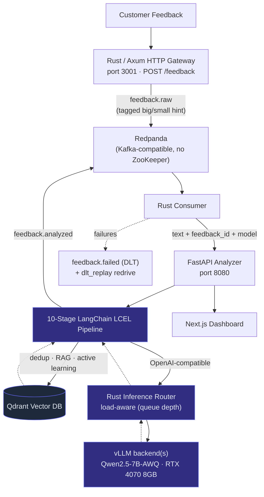
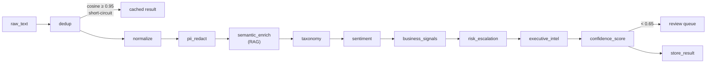
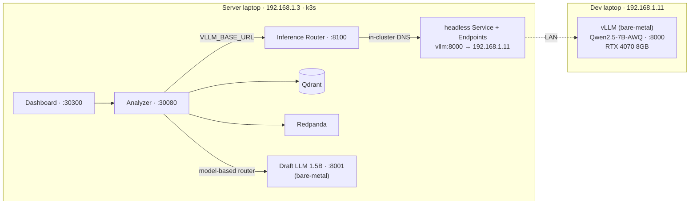
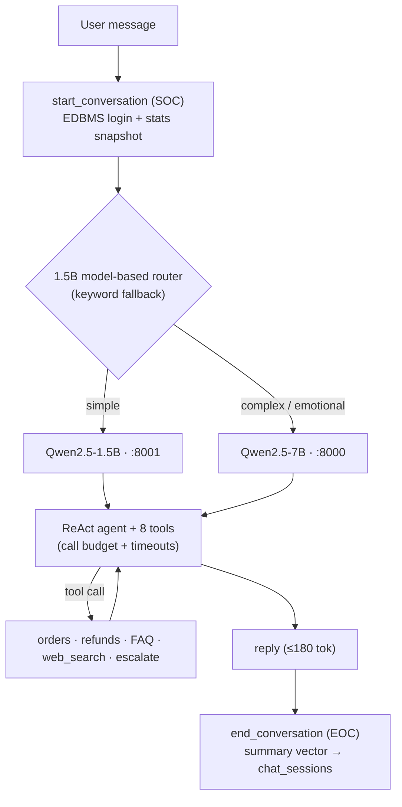

# CX Semantic Analyzer

A production-grade **Customer Experience (CX) intelligence platform** — self-hosted LLM inference, a 10-stage LangChain pipeline, Qdrant vector DB, Rust/Kafka ingestion, an agentic support chatbot, and a Next.js analytics dashboard. Deployed on a two-machine home lab over LAN.

> **Measured performance:** 82 tok/s · 63 ms TTFT (p50) at concurrency 2 — on a laptop RTX 4070 8GB with AWQ + Marlin kernel. Beats desktop RTX 4070 llama.cpp numbers (71 tok/s) from a laptop GPU with 8GB vs 12GB VRAM.

---

## What It Does

Paste any customer feedback → get back structured intelligence in under 30 seconds end-to-end:

| Output | Detail |
|---|---|
| Taxonomy | Category (Billing/Product/Support/Shipping/Account/Onboarding) + subcategory + confidence |
| Sentiment & emotions | positive/negative/neutral + emotion list + intensity 1–10 |
| Business signals | Churn risk · upsell opportunity · feature requests · bug reports · competitor mentions |
| Risk escalation | Escalate flag · risk level (low/medium/high/critical) · suggested action |
| Executive intelligence | 2-sentence summary · action items · health score 1–10 |
| Confidence score | Weighted pipeline confidence (taxonomy × sentiment consistency × novelty) |
| Deduplication | Cosine similarity ≥ 0.95 → cached result returned, zero LLM calls |

---

## Architecture



Inference goes through the **Rust router**, which load-balances across vLLM backends by
live queue depth (`vllm:num_requests_running` + `waiting`) — not client-side round-robin.
The analyzer points `VLLM_BASE_URL` at the router and never load-balances itself.

### Pipeline Stages



### Deployment Topology

| Machine | IP | Role |
|---|---|---|
| Dev laptop | 192.168.1.11 | vLLM bare-metal (RTX 4070 8GB) — port 8000 |
| Server laptop | 192.168.1.3 | k3s cluster — all services (NodePorts below) |

vLLM runs off-cluster. A headless k8s `Service + Endpoints` routes in-cluster DNS (`http://vllm:8000`) to the dev laptop over LAN — no code changes needed inside the cluster.



| Service | NodePort | URL |
|---|---|---|
| Analyzer API | 30080 | `http://192.168.1.3:30080` |
| Dashboard | 30300 | `http://192.168.1.3:30300` |
| Draft LLM (1.5B) | 8001 | bare-metal on server laptop |

---

## Extensions

Beyond the core pipeline, the following are fully implemented:

### Agentic Support Chatbot (`analyzer/chatbot/`)
LangGraph ReAct agent with **model cascade routing**:
- **Simple queries** → Qwen2.5-1.5B (draft model, server laptop 1650 Ti, port 8001) — fast and cheap
- **Complex / emotional queries** → Qwen2.5-7B (big model) — authoritative reasoning



Routing is **model-based** (`analyzer/routing.py`): a low-token call to the 1.5B model
classifies complex/simple, reading intent rather than keywords (e.g. "I'm fine, just
want to cancel" → complex). The keyword list is only a fallback when the draft model is
unavailable. Tools have a per-turn call budget (web_search capped) and wall-clock timeouts.

Tools: `get_my_orders` · `lookup_purchase_context` · `get_account_info` · `log_complaint` · `request_refund` · `escalate_to_human` · `get_faq_answer` · `web_search` (DuckDuckGo, no API key)

Auth: SQLite EDBMS (`edbms.py`) — login with username + password; agent queries purchase history by keyword from the customer's account. Demo users: `alice/bob/carol/dave/eve` — password `pass123`.

Session memory capped at 250 tokens. Sessions expire after 1 hour.

### Topic Clustering (`analyzer/clustering.py`)
KMeans over stored feedback embeddings. Auto-selects k via silhouette score sweep (k=3–12). LLM generates 3–5 word human-readable labels per cluster. Writes `cluster_id` + `cluster_label` back to Qdrant payloads.

### Semantic Drift Detection (`analyzer/drift.py`)
Three signals comparing recent (7 days) vs baseline (30 days):
- Embedding centroid cosine distance (alert > 0.10)
- Negative sentiment fraction shift (alert > 15pp)
- Category KL divergence (alert > 0.30)

### Active Learning Loop (`analyzer/active_learning.py`)
Items with `pipeline_confidence < 0.65` are queued for human review. Human corrections patch the stored analysis and add to `few_shot_examples` — future analyses benefit via RAG.

### Confidence Scoring (`analyzer/pipeline/confidence_stage.py`)
Weighted score: taxonomy confidence (0.4) × sentiment consistency (0.3) × novelty (0.3).

### Agentic Review Workflow (`analyzer/review_agent.py`)
Separate LangGraph agent that synthesises queue status, drift alerts, and escalation counts into a `ReviewReport` with action items and risk level.

### Distributed Inference (`kafka_queue/src/bin/router.rs`)
A load-aware Rust router is the single load balancer in front of the vLLM backends. It
scrapes each backend's `vllm:num_requests_running` + `num_requests_waiting`, tracks an
EWMA of queue depth plus in-flight requests it has dispatched, and routes each call to
the least-loaded healthy backend (round-robin only as a cold-start fallback). It
reverse-proxies the OpenAI-compatible request, streaming responses through. The analyzer
points `VLLM_BASE_URL` at it and does **not** load-balance client-side.

---

## Stack

| Layer | Technology |
|---|---|
| LLM inference | vLLM · Qwen2.5-7B-Instruct-AWQ · AWQ + Marlin kernel |
| Draft model | Qwen2.5-1.5B-Instruct · port 8001 · server laptop 1650 Ti |
| Pipeline | Python · LangChain LCEL · Pydantic structured outputs |
| Agent framework | LangGraph 0.4 · ReAct · ToolNode |
| Vector DB | Qdrant · `all-MiniLM-L6-v2` (384-dim) |
| Customer EDBMS | SQLite · keyword-aware purchase history queries |
| Web search | DuckDuckGo (langchain-community, no API key) |
| Message broker | Redpanda (Kafka-compatible, no ZooKeeper) |
| Ingestion gateway | Rust · Axum · rdkafka |
| API | FastAPI · optional API-key auth (`API_KEY` env var) |
| Dashboard | Next.js 14 · Tailwind CSS · SWR · Recharts |
| Kubernetes | k3s · flannel CNI |
| Monitoring | Prometheus · Grafana |

---

## Performance

Measured on RTX 4070 Laptop 8GB, Qwen2.5-7B-Instruct-AWQ, `--quantization awq_marlin`, `--max-num-seqs 2`:

| Concurrency | Req/s | Tok/s | TTFT p50 | TTFT p95 | ITL p95 |
|:-----------:|:-----:|:-----:|:--------:|:--------:|:-------:|
| 1 | 3.0 | 44 | 56 ms | 60 ms | 22 ms |
| **2** | **5.9** | **82** | **63 ms** | **65 ms** | **22 ms** |
| 4 | 6.1 | 88 | 381 ms | 422 ms | 22 ms |
| 8 | 5.7 | 85 | 958 ms | 1161 ms | 23 ms |

**Concurrency 2 is the sweet spot** — matches `--max-num-seqs 2`. Beyond c=2, requests queue and TTFT degrades sharply while tok/s plateaus.

For the full report and comparison to published numbers (A100 official Qwen benchmark, desktop RTX 4070 llama.cpp): [`tests/BENCHMARK_RESULTS.md`](tests/BENCHMARK_RESULTS.md).

---

## Quick Start

### 1. Start vLLM (dev laptop, bare-metal)
```bash
# Open firewall so server can reach it
sudo firewall-cmd --add-port=8000/tcp

vllm serve Qwen/Qwen2.5-7B-Instruct-AWQ \
  --host 0.0.0.0 --port 8000 \
  --dtype half --max-model-len 1024 \
  --gpu-memory-utilization 0.82 \
  --quantization awq_marlin \
  --max-num-seqs 2 --enforce-eager
```

### 2. Start draft LLM (server laptop, bare-metal)
```bash
vllm serve Qwen/Qwen2.5-1.5B-Instruct \
  --host 0.0.0.0 --port 8001 \
  --dtype half --max-model-len 1024 \
  --gpu-memory-utilization 0.60 \
  --max-num-seqs 4 --enforce-eager
```

### 3. Deploy to k3s (server laptop)
```bash
# Sync source from dev laptop (run on server)
rsync -av vinesh@192.168.1.11:/home/vinesh/Documents/Summer2026/ ~/Summer2026/

# Build custom images
cd ~/Summer2026
docker build -t semantic-analyzer-dev .
docker build --network=host -t cx-gateway kafka_queue/
docker tag cx-gateway cx-producer
docker tag cx-gateway cx-consumer
docker build -t cx-dashboard dashboard/

# Import into k3s containerd (no output until done — wait for prompt)
for img in semantic-analyzer-dev cx-producer cx-consumer cx-dashboard; do
  docker save $img | sudo k3s ctr images import -
done

# Deploy
kubectl apply -f k8s/namespace.yaml
kubectl apply -f k8s/vllm/ k8s/draft-llm/ k8s/qdrant/ k8s/redpanda/ \
              k8s/analyzer/ k8s/producer/ k8s/consumer/ \
              k8s/dashboard/ k8s/monitoring/

# Verify
kubectl -n cx-pipeline get pods
curl http://192.168.1.3:30080/ready
```

### 4. Access
| What | URL |
|---|---|
| Dashboard | http://192.168.1.3:30300 |
| Support Chat | http://192.168.1.3:30300/chat — login: `alice` / `pass123` |
| API docs | http://192.168.1.3:30080/docs |
| Grafana | http://192.168.1.3:30300/grafana (separate Grafana NodePort) |

---

## Pipeline Usage

```bash
# Enter dev container
docker-compose run --rm dev

# Analyze single feedback
python -m analyzer.main --text "My order arrived damaged, I want a refund"

# Batch from CSV
python run_pipeline.py --source csv --file tests/dummy_data/reviews.csv \
  --text-col text --out results.json

# Run tests (mocked — no vLLM needed)
python -m pytest tests/test_pipeline.py -v

# Run benchmarks (requires vLLM running)
python tests/benchmark_vllm.py --concurrency 1 2 4 --prompts 20
```

---

## Fine-Tuning Pipeline (`training/`)

QLoRA fine-tuning on pipeline outputs using unsloth + TRL. Requires `pip install unsloth trl datasets autoawq`.

```bash
# 1. Export high-confidence pipeline outputs as SFT training data
python training/export_sft_data.py --min-confidence 0.75 --out training/data/sft.jsonl

# 2. Export human corrections from active learning as DPO pairs
python training/export_dpo_data.py --out training/data/dpo.jsonl

# 3. SFT — QLoRA on Qwen2.5-7B-Instruct (not AWQ — fine-tune in BF16)
python training/sft_train.py --data training/data/sft.jsonl

# 4. DPO — preference alignment on SFT adapter
python training/dpo_train.py --data training/data/dpo.jsonl

# 5. Merge LoRA + quantize to AWQ → deploy back to vLLM
bash training/merge_and_quantize.sh
```

---

## Project Structure

```
├── analyzer/                   # FastAPI app + LangChain pipeline
│   ├── pipeline/               # 10 stage modules (normalization → store_result)
│   │   └── confidence_stage.py # Weighted confidence score + review queue trigger
│   ├── chatbot/                # LangGraph ReAct support agent
│   │   ├── agent.py            # Graph, sessions, SOC/EOC lifecycle
│   │   ├── cascade_llm.py      # Query classifier → 1.5B or 7B routing
│   │   ├── edbms.py            # SQLite customer DB (auth + purchase history)
│   │   └── tools.py            # 8 agent tools incl. web search
│   ├── active_learning.py      # Review queue, human correction flow
│   ├── clustering.py           # KMeans + silhouette auto-k + LLM labels
│   ├── drift.py                # Centroid / sentiment / category drift signals
│   ├── review_agent.py         # Agentic review workflow (LangGraph)
│   ├── llm.py                  # Distributed vLLM client (round-robin)
│   ├── schemas.py              # Pydantic output models
│   └── api.py                  # FastAPI endpoints (21 routes + optional API-key auth)
├── training/                   # Fine-tuning pipeline
│   ├── export_sft_data.py      # Qdrant → ShareGPT JSONL
│   ├── export_dpo_data.py      # Review queue corrections → DPO pairs
│   ├── sft_train.py            # QLoRA SFT (unsloth + TRL)
│   ├── dpo_train.py            # DPO preference alignment
│   ├── merge_lora.py           # Merge adapter → full BF16
│   ├── quantize_awq.py         # AWQ 4-bit quantization (autoawq)
│   └── merge_and_quantize.sh   # One-shot post-training pipeline
├── kafka_queue/                # Rust producer + consumer (Axum + rdkafka)
│   └── src/bin/                # producer.rs (HTTP → Kafka) · consumer.rs (Kafka → API)
├── ingestion/                  # Pluggable source adapters
│   └── sources/                # CSV · NPS · Google Forms · Typeform
├── vectordb/                   # Qdrant client, embedder, retrieval patterns
│   ├── store.py                # store_analysis · find_duplicates · get_rag_context
│   ├── embedder.py             # GPU embedder (EMBEDDER_URL) with CPU fallback
│   └── retrieval.py            # filtered_search · time_window_search · export_embeddings
├── services/embedder/          # GPU embedding microservice (FastAPI, port 8081)
├── dashboard/                  # Next.js 14 dashboard
│   ├── app/outputs/            # Split layout: scrollable feedback list (left) · stats panel (right)
│   ├── app/analyze/            # Live pipeline input (no-cache, for testing)
│   ├── app/system/             # Hardware utilization gauges
│   ├── app/chat/               # Full-page support chat (EDBMS login)
│   └── components/             # ChatWidget (floating) · ChatWindow · SentimentChart · …
├── tests/
│   ├── benchmark_vllm.py       # TTFT · ITL · tok/s benchmark (streaming)
│   ├── benchmark_pipeline.py   # E2E pipeline latency benchmark
│   ├── BENCHMARK_RESULTS.md    # Measured results + comparison to published numbers
│   └── dummy_data/             # CSV fixtures for pipeline tests
├── k8s/                        # Kubernetes manifests
│   ├── vllm/                   # Headless service → dev laptop GPU
│   ├── draft-llm/              # Headless service → server laptop 1.5B model
│   ├── analyzer/               # Deployment · Service · ConfigMap
│   ├── qdrant/ redpanda/       # StatefulSets
│   └── monitoring/             # Prometheus + Grafana
└── monitoring/                 # Prometheus config + Grafana dashboards
```

---

## Failure Recovery Matrix

How the system behaves when each dependency fails — what detects it, what recovers it,
and whether any data is lost. Exercised by `tests/test_fault_injection.py` and the
alert rules in `monitoring/alerts.yml`.

| Failure | Detected by | Recovery mechanism | Data loss? |
|---|---|---|---|
| **Qdrant down — dedup** | exception in `find_duplicates` | swallowed; pipeline runs full analysis (no cache, no crash) | None (just no dedup) |
| **Qdrant down — store** | exception in `store_analysis` | analysis completes; result published to `feedback.store_retry` (Kafka), replayed by the retry consumer when Qdrant recovers; local file buffer if Kafka also down | None |
| **vLLM down / slow** | analyzer 5xx; `/ready` 503; `vLLMHighTTFT` alert | consumer retries 3× w/ backoff → DLT; k8s stops routing on 503; router drops the unhealthy backend | None (DLT) |
| **One vLLM backend overloaded** | router scrapes queue depth | router routes to the least-loaded healthy backend | None |
| **Analyzer down** | consumer HTTP error | retry 3× → DLT → `dlt_replay` redrive | None (DLT) |
| **Kafka publish fails (producer)** | `send()` error | `POST /feedback` returns 503 to the client (back-pressure) | None (client can resubmit) |
| **Result publish fails (consumer)** | `send()` error | message → DLT; offset committed only on DLT success | None |
| **DLT publish fails** | `send_to_dlt` → false | **offset NOT committed** → message redelivered | None |
| **Bad schema / undecodable msg** | schema-version / decode guard | → DLT (permanent), logged; never auto-replayed | Quarantined, inspectable |
| **Draft (1.5B) model down** | exception in routing/`get_llm` | routing falls back to keywords; analysis falls back to the big model | None (degraded routing) |
| **Tool hangs (e.g. web_search)** | `TOOL_TIMEOUT_SECONDS` | tool returns a graceful timeout message; budget caps repeat calls | None |
| **Agent loops** | `recursion_limit` | graph stops; graceful "connect to a human" reply | None |
| **DLT backlog grows** | `DeadLetterMessages` / `Flood` alerts | `dlt_replay` CronJob redrives transient failures every 15m | None |

---

## Architectural Tradeoffs

| Decision | Chosen | Alternative | Why |
|---|---|---|---|
| Model cascade | 1.5B model-based routing (keyword fallback) | vLLM speculative decoding | vLLM spec decode is single-machine; draft and target are on different GPUs |
| Inference LB | Load-aware Rust router (queue depth) | Client-side round-robin | Round-robin is blind to load; the router routes to the least-loaded backend |
| Session store | In-process dict + TTL | Redis / LangGraph CheckpointSaver | No extra infra; single-instance k3s deployment |
| Customer DB | SQLite (auto-seeded) | PostgreSQL | Zero infra overhead for demo; portable if scale requires |
| Fine-tuning | QLoRA (4-bit + LoRA r=16) | Full SFT / FSDP | 8GB VRAM can't hold 7B BF16 in training mode |
| Preference alignment | DPO (no reward model) | PPO + reward model | PPO needs 3–4 models in VRAM; DPO is single-model |
| Web search | DuckDuckGo | Tavily | No API key or quota; internal deployment |
| Dedup | Pre-pipeline cosine ≥ 0.95 | Post-pipeline result cache | Short-circuits before any LLM calls; threshold tunable |
| Trend aggregation | Batch after pipeline | Kafka Streams / Flink | Current scale doesn't justify streaming processor overhead |

---

## Known Issues / Tech Debt

- **No auth on Kafka gateway** — `POST /feedback` (Rust producer) has no auth. Intentional MVP scope; the FastAPI analyzer now supports optional `API_KEY` header.
- **Trend aggregation is batch** — acknowledged design decision; see tradeoffs above.
- **Dedup vector mismatch** — fixed in this version: `store.py` now embeds `raw_text` (not `summary`) so dedup lookup vectors are consistent with stored vectors.
- **qdrant-client 1.18** broke the `.search()` API (now `.query_points()`). `store.py` still uses the old API inside Docker where an older client version is pinned; `retrieval.py` uses the new API.
